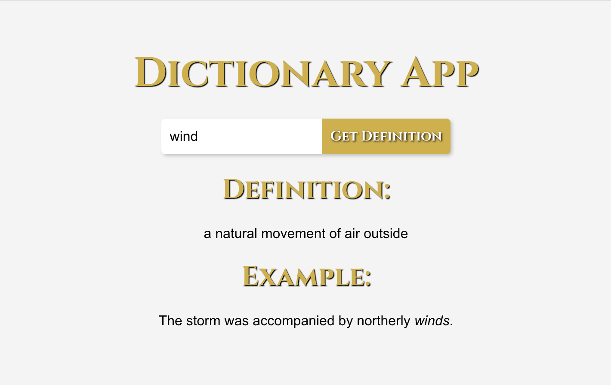

# Dictionary App
I have deployed the app using GitHub Pages. Check out the live demo below:

- GitHub Pages: [here](https://M311HAN.github.io/dictionary-app/)



## Table of Contents
- [Description](#description)
- [Features](#features)
- [Technologies Used](#technologies-used)
- [Installation](#installation)
- [Usage](#usage)
- [Components](#components)
- [License](#license)
- [Create React App Info](#create-react-app-info)

## Description

The Dictionary App is a React application that allows users to search for the definitions and example sentences of words using the Merriam-Webster API. The app provides a simple and intuitive interface for looking up word meanings and example usages.

The API key for accessing the Merriam-Webster API is stored in a `.env` file. This approach is used to keep the API key secure and prevent it from being exposed in the codebase. By using environment variables, we ensure that sensitive information like API keys are not hardcoded into the source code, which enhances the security of the application.

## Features

- Search for the definition of any word.
- Fetch and display example sentences for the word.
- Error handling for failed API requests.
- Snapshot testing for component rendering.
- Unit testing for fetch functionality.

## Technologies Used

- React
- Axios
- Jest
- React Testing Library
- Babel

## Installation

To install and run this project locally, follow these steps:

1. Clone the repository:
   ```bash
   git clone https://github.com/your-username/dictionary-app.git
    cd dictionary-app
    ```

2. Install the dependencies:
    ```bash
    npm install
    ```

3. Start the development server:
    ```bash
    npm start
    ```
Open your browser and navigate to `http://localhost:3000`.

## Usage

How the Program Works:

- Open the App: Once the application is running, open your web browser and navigate to http://localhost:3000 (if it doesn't open automatically).

- Enter a Word: You will see an input field labeled "Enter a word". Type in any word you want to look up.

- Get Definition: Click the "Get Definition" button to search for the word. The app will make a request to the Merriam-Webster API to fetch the definition and example sentence for the word.

- View Results:

* Definition: The definition of the word will be displayed below the input field under the "Definition" heading.

* Example Sentence: An example sentence using the word will be displayed under the "Example" heading.

* Error Handling: If there is an issue fetching the data (e.g., network error, invalid API key, or word not found), an error message will be displayed to inform you of the issue.

To run the tests, use:

    ```bash
    npm test
    ```
This will execute the snapshot and unit tests to ensure the components and fetch functionality work correctly.

## Components

## Dictionary.js
The `Dictionary` component is the main component of the app, responsible for fetching and displaying word definitions and examples.

How it works:

1. State Management:

* `word`: Stores the current word entered by the user.
* `definition`: Stores the fetched definition of the word.
* `example`: Stores the fetched example sentence of the word.
* `error`: Stores any error messages that occur during the fetch process.

2. fetchDefinition Function:

* Makes an HTTP GET request to the Merriam-Webster API to fetch the definition and example of the word.
* Parses the API response to extract the definition and example sentence.
* Updates the component state with the fetched data or sets an error message if the request fails.

3. handleSubmit Function:

* Handles the form submission event.
* Calls the fetchDefinition function to fetch data when the user submits the form.

4. Rendering:

* Displays the input field for the user to enter a word.
* Displays the fetched definition and example sentence, if available.
* Displays any error messages that occur during the fetch process.

## DictionaryFetch.test.js

* Tests the fetchDefinition function to ensure it correctly fetches and displays the definition and example of a word.

## Dictionary.test.js

* Snapshot test to ensure the Dictionary component renders correctly.

## License

This project is licensed under the MIT License and created by Melihhan (https://github.com/M311HAN). [Visit the repository](https://github.com/M311HAN?tab=repositories) for more projects and further collaboration.

## Create React App Info

# Getting Started with Create React App

This project was bootstrapped with [Create React App](https://github.com/facebook/create-react-app).

## Available Scripts

In the project directory, you can run:

### `npm start`

Runs the app in the development mode.\
Open [http://localhost:3000](http://localhost:3000) to view it in your browser.

The page will reload when you make changes.\
You may also see any lint errors in the console.

### `npm test`

Launches the test runner in the interactive watch mode.\
See the section about [running tests](https://facebook.github.io/create-react-app/docs/running-tests) for more information.

### `npm run build`

Builds the app for production to the `build` folder.\
It correctly bundles React in production mode and optimizes the build for the best performance.

The build is minified and the filenames include the hashes.\
Your app is ready to be deployed!

See the section about [deployment](https://facebook.github.io/create-react-app/docs/deployment) for more information.

### `npm run eject`

**Note: this is a one-way operation. Once you `eject`, you can't go back!**

If you aren't satisfied with the build tool and configuration choices, you can `eject` at any time. This command will remove the single build dependency from your project.

Instead, it will copy all the configuration files and the transitive dependencies (webpack, Babel, ESLint, etc) right into your project so you have full control over them. All of the commands except `eject` will still work, but they will point to the copied scripts so you can tweak them. At this point you're on your own.

You don't have to ever use `eject`. The curated feature set is suitable for small and middle deployments, and you shouldn't feel obligated to use this feature. However we understand that this tool wouldn't be useful if you couldn't customize it when you are ready for it.

## Learn More

You can learn more in the [Create React App documentation](https://facebook.github.io/create-react-app/docs/getting-started).

To learn React, check out the [React documentation](https://reactjs.org/).

### Code Splitting

This section has moved here: [https://facebook.github.io/create-react-app/docs/code-splitting](https://facebook.github.io/create-react-app/docs/code-splitting)

### Analyzing the Bundle Size

This section has moved here: [https://facebook.github.io/create-react-app/docs/analyzing-the-bundle-size](https://facebook.github.io/create-react-app/docs/analyzing-the-bundle-size)

### Making a Progressive Web App

This section has moved here: [https://facebook.github.io/create-react-app/docs/making-a-progressive-web-app](https://facebook.github.io/create-react-app/docs/making-a-progressive-web-app)

### Advanced Configuration

This section has moved here: [https://facebook.github.io/create-react-app/docs/advanced-configuration](https://facebook.github.io/create-react-app/docs/advanced-configuration)

### Deployment

This section has moved here: [https://facebook.github.io/create-react-app/docs/deployment](https://facebook.github.io/create-react-app/docs/deployment)

### `npm run build` fails to minify

This section has moved here: [https://facebook.github.io/create-react-app/docs/troubleshooting#npm-run-build-fails-to-minify](https://facebook.github.io/create-react-app/docs/troubleshooting#npm-run-build-fails-to-minify)
